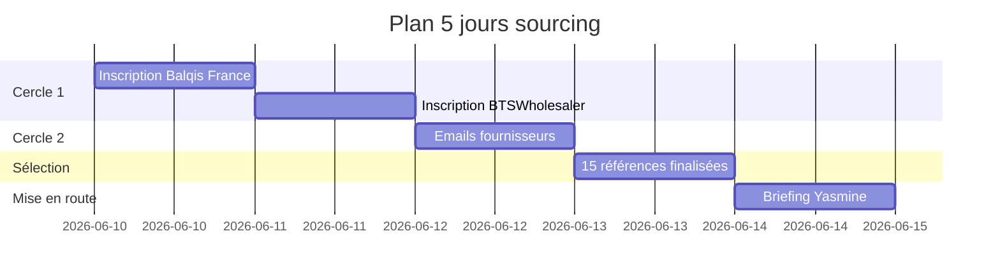

---
tags:
  - plan-action
  - sourcing
  - opérationnel
type: plan-opérationnel
parent: "[[MOC - Omar de Mogador]]"
horizon: 5-jours
---

# Plan 5 jours — Activation sourcing

> [!info] Plan opérationnel
> Cinq jours pour passer de zéro fournisseur opérationnel à un catalogue de 15 références prêt à charger sur la boutique.

---

## Vue d'ensemble

---

## Détail jour par jour

### Jour 1 — Balqis France
**Action**
- Inscription compte pro sur balqis-france.com
- Récupération du catalogue dropshipping complet
- Identification des 30–40 produits compatibles avec le positionnement

**Livrable**
Liste filtrée des produits Balqis pertinents avec : prix d'achat, prix de vente conseillé, marge brute estimée

**Temps estimé** : 2 h

---

### Jour 2 — BTSWholesaler
**Action**
- Inscription compte pro
- Installation du module PrestaShop (gratuit)
- Tour du catalogue parfumerie

**Livrable**
- Module installé en environnement de test
- Pré-sélection de 20 références parfumerie cohérentes

**Temps estimé** : 3 h (technique inclus)

---

### Jour 3 — Contact 2e cercle
**Action**
Envoi d'emails B2B aux quatre fournisseurs du 2e cercle :
- L'Univers Oriental
- Grossiste Orient
- Alepia
- Naturare

**Email type** : voir [[Fournisseurs - 2e cercle]]

**Livrable**
- 4 emails envoyés
- Suivi tableur des relances éventuelles

**Temps estimé** : 1 h

---

### Jour 4 — Sélection finale
**Action**
- Comparaison des catalogues reçus
- Sélection finale de **15 références** pour le lancement
- Validation cohérence éditoriale avec [[Identité de marque]]

**Livrable**
Tableau final des 15 SKU avec :
- Fournisseur
- Prix achat
- Prix vente
- Marge
- Catégorie
- Statut (validé / en attente)

**Temps estimé** : 3 h

---

### Jour 5 — Briefing Yasmine
**Action**
Briefer [[Yasmine]] (avatar chef de projet) avec :
- La liste finale des 15 références
- L'objectif Aïd al-Adha
- Le budget marketing de 100 € disponible
- Les contraintes techniques de la boutique existante

**Livrable**
Plan de mise en ligne structuré par Yasmine :
- Ordre de chargement des produits
- Rédaction des fiches confiée à [[Nour]]
- Visuels confiés à [[Sofia]]
- Stratégie pub confiée à [[Marco]]
- Plan SEO confié à [[Leïla]]

**Temps estimé** : 1 h de briefing + plan livré par Yasmine

---

## Checklist globale

- [ ] Compte Balqis France ouvert
- [ ] Catalogue Balqis téléchargé
- [ ] Compte BTSWholesaler ouvert
- [ ] Module PrestaShop BTSWholesaler installé
- [ ] Emails 2e cercle envoyés (4 fournisseurs)
- [ ] 15 références sélectionnées
- [ ] Briefing Yasmine effectué
- [ ] Plan de mise en ligne reçu

---

## Liens internes
- [[Stratégie sourcing]]
- [[Produits qui cartonnent 2026]]
- [[Fournisseurs - 1er cercle]]
- [[Fournisseurs - 2e cercle]]
- [[Yasmine]]
- [[Journal de décisions]]
