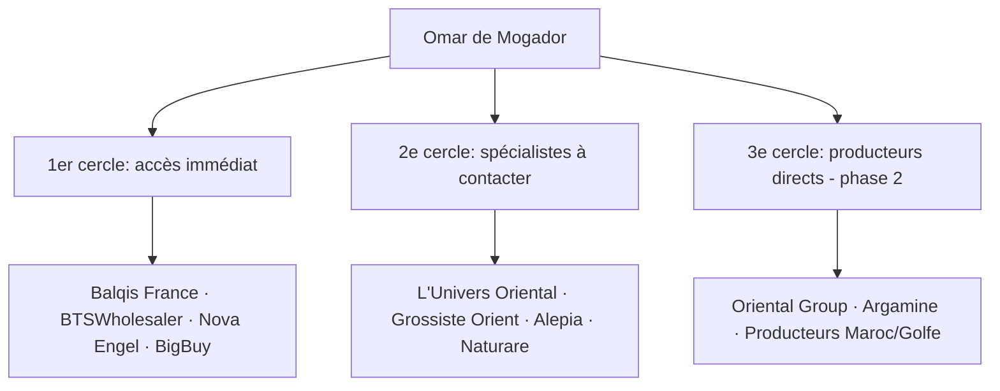

---
tags:
  - sourcing
  - stratégie
  - dropshipping
type: stratégie
parent: "[[MOC - Sourcing]]"
---

# Stratégie sourcing

> [!info] Architecture en trois cercles
> Trois temps, trois niveaux d'accès. Chaque cercle correspond à un degré de maturité de la maison et de son fondateur.

---

## Diagnostic de départ

Contraintes à intégrer :
- **Statut auto-entrepreneur** avec SIRET mais **sans TVA intracommunautaire**
- **Budget initial limité** → dropshipping pur sans achat de stock
- **Pas d'abonnement mensuel obligatoire** acceptable

> [!warning] Ce que la contrainte impose
> Tant que vous restez auto-entrepreneur sans TVA intracom, vous restez prisonnier du milieu de marché. Les vraies marges (30 à 50 % de mieux) commencent au moment où vous passez à un statut société avec TVA intracommunautaire.

---

## Architecture stratégique en trois cercles

### Premier cercle — accès immédiat
**Quand** : maintenant
**Pourquoi** : seul le SIRET est requis, pas de minimum, dropshipping pur
**Marge moyenne** : 35–55 %
**Risque** : faible

→ [[Fournisseurs - 1er cercle]]

### Deuxième cercle — spécialistes orientaux à contacter
**Quand** : J+3 à J+10
**Pourquoi** : tarifs B2B sur demande, négociation par email/téléphone
**Marge moyenne** : 45–60 %
**Risque** : modéré (qualité à vérifier, délais variables)

→ [[Fournisseurs - 2e cercle]]

### Troisième cercle — sourcing direct producteurs
**Quand** : après évolution juridique (3–6 mois)
**Pourquoi** : marges supérieures, exclusivité possible, authenticité maximale
**Marge moyenne** : 60–80 %
**Risque** : élevé sur le démarrage, faible une fois la relation établie

→ [[Fournisseurs - 3e cercle]]

---

## Répartition stratégique recommandée

| Catégorie produit | Fournisseur prioritaire | Statut |
|---|---|---|
| Soins bio orientaux (argan, savons, ghassoul) | **Balqis France** | 1er cercle, à activer immédiatement |
| Parfumerie générale | **BTSWholesaler** ou **Nova Engel** | 1er cercle, à activer immédiatement |
| Produits hammam complets | **L'Univers Oriental** | 2e cercle, contact par email |
| Savons d'Alep premium | **Alepia** | 2e cercle, contact par email |
| Oud et bakhour authentique | **Oriental Group** (Maroc) | 3e cercle, après statut société |

---

## Le piège à éviter

> [!danger] Le syndrome du revendeur lambda
> Aujourd'hui, en tant que client particulier, vous achetez au même prix que vos clients potentiels. **Conséquence** : marge nulle ou négative.
>
> Solution immédiate : ouvrir des comptes pro chez Balqis France et BTSWholesaler dès cette semaine.

---

## Liens internes
- [[MOC - Sourcing]]
- [[Produits qui cartonnent 2026]]
- [[Fournisseurs - 1er cercle]]
- [[Fournisseurs - 2e cercle]]
- [[Fournisseurs - 3e cercle]]
- [[Plan 5 jours]]
