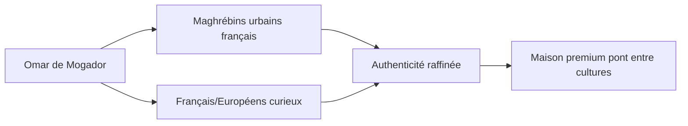

---
tags:
  - marque
  - naming
  - positionnement
type: décision-stratégique
parent: "[[Identité de marque]]"
---

# Naming et positionnement

---

## Décision finale

**Nom de marque** : *Omar de Mogador*

**Taglines** :
- **Courte universelle** : *Orient · Occident*
- **Longue narrative** : *Une maison entre deux rives*

---

## Genèse de la décision

> [!quote] Pivot stratégique
> Le nom initial *Ethnika Oud* situait la marque comme un bazar spécialisé dans l'oud. *Omar de Mogador* la repositionne comme une maison narrative aux ambitions cosmopolites.

### Pourquoi *Omar*
- Prénom du fondateur — ancrage humain et personnel
- Évite l'abstraction d'un nom de catégorie
- Crée d'emblée un personnage, une histoire racontable

### Pourquoi *Mogador*
- Ancien nom d'**Essaouira** (Maroc)
- Ville-port ouverte sur l'Atlantique
- Symbole historique du commerce entre Orient et Occident depuis le XVIIIᵉ siècle
- Sonorité française, accessible à tous les publics

---

## Cibles et positionnement

### Pas une marque communautaire fermée
La maison s'adresse simultanément aux deux publics — c'est précisément ce qui la distingue des concurrents qui choisissent l'un ou l'autre.

### Pas une marque exotique caricaturale
Pas de chameaux, pas de tapis volants, pas de couleurs criardes. La référence est plutôt **Hermès**, **Aesop** ou **Diptyque** dans leur capacité à valoriser une origine sans tomber dans le pittoresque.

---

## Domaines acquis

- `omardemogador.fr` — porte d'entrée française
- `omardemogador.com` — extension internationale francophone (Belgique, Suisse, Canada)
- `omardemogador.org` — sécurisation

---

## Liens internes
- [[Identité de marque]]
- [[Charte graphique]]
- [[MOC - Omar de Mogador]]
